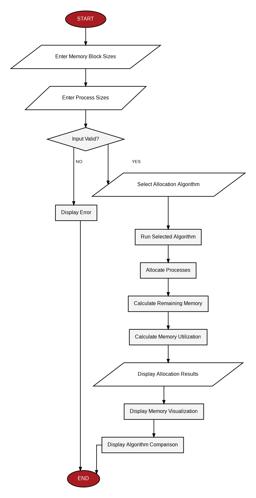

# Contiguous Memory Allocation Simulator

A Python-based interactive simulator for demonstrating **contiguous memory allocation** using the **First Fit, Best Fit, and Worst Fit** algorithms.

The project provides a Streamlit web interface where users can enter memory blocks and process sizes, run an allocation strategy, visualize memory usage, and compare the three algorithms.

---

## Features

- First Fit memory allocation
- Best Fit memory allocation
- Worst Fit memory allocation
- Custom memory block sizes
- Custom process sizes
- Process allocation table
- Allocated and unallocated process counts
- Remaining memory calculation
- Memory utilization calculation
- Visual representation of memory blocks
- Comparison of all three algorithms
- Input validation and error handling

---

## Technologies Used

- **Python 3**
- **Streamlit**
- **Git / GitHub**

---

## Project Structure

```text
OsProjectMiniFinal/
│
├── app.py
├── algorithms.py
├── requirements.txt
├── README.md
├── PROJECT.md
├── Contiguous_Memory_Allocation_Simulator_Final_Report.docx
├── Contiguous_Memory_Allocation_Simulator_Presentation.pptx
├── Contiguous_Memory_Allocation_Simulator_Report.md
└── contiguous_memory_allocation_flowchart.png
```

---

## How It Works

The simulator takes:

### Inputs

```text
Memory block sizes
Process sizes
Allocation algorithm
```

Example:

```text
Memory Blocks:
100, 500, 200, 300, 600

Processes:
212, 417, 112, 426
```

### Outputs

```text
Process allocation
Unallocated processes
Remaining memory
Used memory
Memory utilization
Algorithm comparison
Memory visualization
```

---

## Allocation Algorithms

### First Fit

First Fit searches memory blocks from the beginning and assigns a process to the first block that is large enough.

```text
For each process:
    Search blocks from the beginning
    Allocate to the first suitable block
```

### Best Fit

Best Fit searches all suitable blocks and assigns the process to the smallest block that can accommodate it.

```text
For each process:
    Find the smallest suitable block
    Allocate the process
```

### Worst Fit

Worst Fit searches all suitable blocks and assigns the process to the largest available block.

```text
For each process:
    Find the largest suitable block
    Allocate the process
```

---

## System Flowchart



---

## Installation

Clone the repository:

```bash
git clone https://github.com/Algor8m/contiguous-memory-allocation-simulator.git
```

Move into the project directory:

```bash
cd contiguous-memory-allocation-simulator
```

Create and activate a virtual environment if desired:

### Windows

```bash
python -m venv .venv
.venv\Scripts\activate
```

Install dependencies:

```bash
pip install -r requirements.txt
```

---

## Running the Application

Start Streamlit with:

```bash
python -m streamlit run app.py
```

The application will open in your web browser.

---

## Example Test Case

### Memory Blocks

```text
100, 500, 200, 300, 600
```

### Processes

```text
212, 417, 112, 426
```

### Results

| Algorithm | Allocated | Unallocated |
|---|---:|---:|
| First Fit | 3 | 1 |
| Best Fit | 4 | 0 |
| Worst Fit | 3 | 1 |

The application also displays the remaining memory for every block and calculates memory utilization.

---

## Input Validation

The application handles:

- Empty input
- Non-numeric values
- Zero values
- Negative values
- Extra commas

Example invalid input:

```text
100, 500,, 300
```

The application displays an error instead of terminating.

---

## Documentation

The repository includes:

- `PROJECT.md` — detailed project documentation
- `Contiguous_Memory_Allocation_Simulator_Final_Report.docx` — project report
- `Contiguous_Memory_Allocation_Simulator_Presentation.pptx` — presentation
- `contiguous_memory_allocation_flowchart.png` — system flowchart

---

## Project Objective

The objective of this project is to demonstrate how different contiguous memory allocation strategies behave when assigning processes to available memory blocks.

The simulator provides an interactive way to understand process allocation, remaining memory, memory utilization, and the differences between First Fit, Best Fit, and Worst Fit.

---

## License

This project was developed as an academic Operating Systems mini project.
